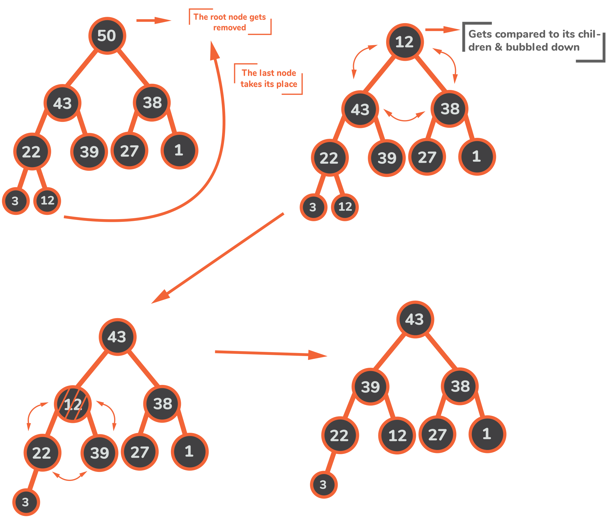
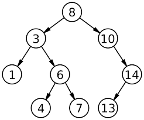

# sort_practice

sort_practice is a practice project for sorting algorithms.

Now, it includes: 

[Bubble Sort](#bubble-sort)

[Selection Sort](#selection-sort)

[Insertion Sort](#insertion-sort)

[Merge Sort](#merge-sort)

[Quick Sort](#quick-sort)

[Heap Sort](#heap-sort)

[Binary Search Tree Sort](#binary-search-tree-sort)

[AVL Tree Sort](#avl-tree-sort)

## Installation

```bash
git clone https://github.com/linhung0319/sort_practice.git
```

## Usage

```bash
python -m sort_practice.app
```
As following, you can call the sorting function in main( ).

code snippet from app.py
```python
def main():
    nums = [5, -1, 4, 2, 2]
    #bubble_sort(nums)
    #selection_sort(nums)
    #insertion_sort(nums)
    #merge_sort(nums)
    #quick_sort(nums)
    heap_sort(nums)
    print(nums)
```

## Tests

You can also use unittest to test the sorting function. 

```bash
python -m unittest -v tests.test_sort_function
```

There are already testing examples in setUp( ). You can add your testing examples in it. setUp( ) is a test fixture which initializes the testing examples before unittest test a test_***_sort( ) function.    

code snippet from test_sort_function.py
```python
import unittest
from sort_practice.sort_function import *

class Test_sort_function(unittest.TestCase):
    def setUp(self):
        self.q1 = [1, 5, -2, 4, 7, 0]
        self.q1_ascend_ans = [-2, 0, 1, 4, 5, 7]

    def test_bubble_sort(self):
        bubble_sort(self.q1)
        self.assertEqual(self.q1, self.q1_ascend_ans)

    def test_selection_sort(self):
        selection_sort(self.q1)
        self.assertEqual(self.q1, self.q1_ascend_ans)
```

---
## Merge Sort vs. Quicksort: FAQs


### Question 1: 

Which is a better sorting algorithm — merge sort or quicksort?

### Answer: 

There’s no definite answer to this question. It really depends on the kind of data we want to sort and what kind of sorting we expect. Both the algorithms have their advantages and disadvantages.
Let’s just go through some scenarios for better understanding:
	 
    
 *   If we want the relative order of equal elements after sorting the data to be preserved, merge sort would be the preferred choice since merge sort is a stable sorting algorithm while quicksort isn’t. Although quicksort can be modified to be stable, it is hard to implement and reduces the algorithm’s efficiency.

* If the cost of allocating new memory is very high, we should always prefer quicksort since it is an in-place sorting algorithm while merge sort requires additional memory. Although merge sort can be modified to work in-place, its efficiency would be reduced.

* If the dataset to be sorted is too big to fit in the memory all at once, using quicksort wouldn’t be possible since it is an internal sorting algorithm and requires random access to the whole dataset during the process of sorting. Merge sort, being an external sorting algorithm, would serve the purpose in this case.

### Question 2: 

Why is merge sort preferred over quicksort for sorting linked lists?

### Answer: 

Quicksort highly depends on randomly accessing the data elements and swap elements in the dataset. Since the memory allocation of linked lists is not necessarily continuous, we can not randomly access elements of a linked list efficiently. This also makes swapping very expensive in linked lists. Merge sort is faster in this situation because it reads the data sequentially. Data insertion in any part of the linked list is also very efficient if we are given the reference to the previous node so that the merge operation can be implemented in-place. Thus, merge sort becomes an ideal sorting algorithm for linked lists.

## Sorting Algorithm

---

You can find the sorting function in ./sort_practice/sort_function.py

## [Bubble Sort](#bubble-sort)

For each pair of indeces, swap the elements if they are out of order

```python
selection_sort(nums, key=lambda x: x, reverse=False)
```

Best : O( n )

Worst : O( n^2 )

Space : O( 1 )

Stable : True


---
## [Selection Sort](#selection-sort)

The algorithm divides the input list into two parts: sorted and unsorted sublists. In each iteration, the minimum (maximum) is selected from the unsorted sublists and swaped behind the end of the sorted sublist.  

* ### Is selection sort stable or not?

The algorithm descibed above not stable, but there is a variant selection sort. Instead of swapping the minimum value with the first element in the unsorted sublist, a variant of selection sort shift the elements between the first element and minimum value in the sublist by one.

The problem is that insertions and shifts aren’t present in the standard formulation of Selection Sort, only the exchanges. So, we could say that the algorithm we’ve just described isn’t a variant of Selection Sort.

However, there’s also ground to argue that it is. It preserves the main idea of Selection Sort: grow a sorted sub-array at the beginning of the array by repeatedly selecting the minimal elements of the unsorted part and placing them right at the end of the sorted sub-array. If we take that perspective, the insertions and shifts are nothing more than implementation details. Hence, they don’t change the logic, so the algorithm is a legitimate variant of Selection Sort.

```python
selection_sort(nums, key=lambda x: x, reverse=False)
```

Best : O( n^2 )

Worst : O( n^2 )

Space : O( 1 )

Stable : True


---

## [Insertion Sort](#insertion-sort)

The input list is divided into two parts: the unsorted and sorted sublist. In each iteration, the first element of the unsorted list is inserted into the correct position of the sorted list. 

```python
insertion_sort(nums, key=lambda x: x, reverse=False)
```

Best : O( n )

Worst : O( n^2 )

Space : O( 1 )

Stable : True


---
## [Merge Sort](#merge-sort)

1. Divide the unsorted list into n sublists, each containing one element (a list of one element is considered sorted).

2. Repeatedly merge sublists to produce new sorted sublists until there is only one sublist remaining. This will be the sorted list.

```python
merge_sort(nums, key=lambda x: x, reverse=False)
```

Best : O( n log n )

Worst : O( n log n )

Space : O( n )

Stable : True


---
## [Quick Sort](#quick-sort)

Quicksort is a divide-and-conquer algorithm. It works by selecting a 'pivot' element from the array and partitioning the other elements into two sub-arrays, according to whether they are less than or greater than the pivot. The sub-arrays are then sorted recursively

```python
quick_sort(nums, key=lambda x: x, reverse=False)
```

Best : O( n log n )

Worst : O( n log n )

Space : O( 1 )

Stable : False


---
## [Heap Sort](#heap-sort)

Use a heap to store the elements in the unsorted array, and pop the element from the heap one by one.

A max-heap is a complete binary tree in which the value in each internal node is greater than or equal to the values in the children of that node. 

```python
heap_sort(nums, key=lambda x: x, reverse=False)
```

Best : O( n log n )

Worst : O( n log n )

Space : O( n )

Stable : False



---
## [Binary Search Tree Sort](#binary-search-tree-sort)

Put the unsorted array into a Binary Search Tree. Traversing the tree inorder gets the sorted array.

```python
BSTree_sort(nums, key=lambda x: x, reverse=False)
```

Best : O( n log n )

Worst : O( n^2 )

Space : O( n )

Stable : True   



---
## [AVL Tree Sort](#avl-tree-sort)

Put the unsorted array into an AVL Tree. Traversing the tree inorder gets the sorted array.

Everytime we insert or delete an element from the tree, nodes in the tree will balance the height of its left subtree and right subtree. 

```python
BSTree_sort(nums, key=lambda x: x, reverse=False)
```

Best : O( n log n )

Worst : O( n log n )

Space : O( n )

Stable : True  